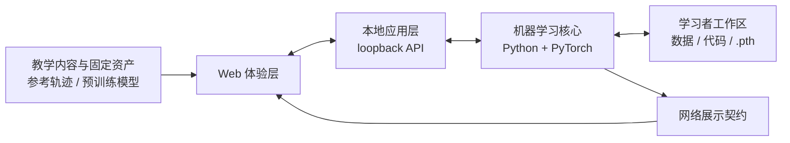

# 手写数字识别学习实验室：全局策略

## 状态

本文记录首个版本已经确认的产品与系统级边界。它是后续产品细化、实现规格、issue 拆分和交付验收的共同入口；尚未确认的细节不得在实现中被默认写死。

领域术语以 [`CONTEXT.md`](../../CONTEXT.md) 为准，单项决策及其理由以 [`docs/adr/`](../adr/) 中的 ADR 为准。

## 产品承诺

产品是一个面向 AI 初学者的本地优先手写数字识别学习实验室，不是单纯展示网站、通用训练平台或自由网络编辑器。

主要学习者掌握基础 Python 和本地命令运行，但尚未掌握 PyTorch、CNN、模型训练与调试。产品必须形成完整学习闭环：

1. **教学推演**：重放预计算但真实的参考轨迹，解释数字如何逐层变成分类结果。
2. **训练旅程**：学习者沿所选挑战路线准备一个可运行模型。
3. **真实实验**：在本机加载模型，手写数字并查看真实预测与逐层实时轨迹。

学习者只有在真实实验中亲手验证所准备的模型，才完成该挑战路线。最低难度可以使用项目提供的预训练模型；自行训练路线使用学习者生成的模型，不设置准确率准入门槛。

相关决策：[ADR-0001](../adr/0001-learning-loop-as-product-boundary.md)、[ADR-0002](../adr/0002-challenge-levels-vary-learner-responsibility.md)、[ADR-0007](../adr/0007-no-quality-gate-for-self-trained-models.md)、[ADR-0008](../adr/0008-fixed-difficulty-per-training-journey.md)、[ADR-0009](../adr/0009-soft-sequencing-with-artifact-checkpoints.md)。

## 挑战路线

- 一次训练旅程固定一个挑战难度；完成后可以用其他难度开始新路线。
- 所有路线共享知识章节、标准网络结构和最终真实实验，仅学习者承担的责任不同。
- 最低难度负责配置环境、放置预训练 `.pth`、启动并验证推理。
- 最高难度不提供训练好的模型；学习者获取数据集，在受控骨架内完成核心代码、训练并保存 `.pth`。
- 最高难度不是空白仓库挑战。项目始终提供仓库结构、接口边界、步骤与验收工具。
- 章节有依赖顺序但始终可查看和返回。产品不设计进度条、完成状态或持久化进度。
- 真实依赖发生时即时验证本地产物；失败必须明确，浏览行为不能替代验证。

挑战路线数量、章节数量及每章任务仍待后续讨论。

## 系统边界

| 边界 | 唯一职责 |
| --- | --- |
| Web 体验层 | 动态叙事、网络结构、代码对照、手写输入与结果展示 |
| 本地应用层 | 一键启动、提供 Web 资产、协调固定的本地 API |
| 机器学习核心 | 标准网络、训练规则、`.pth` 加载、推理和轨迹采集 |
| 教学内容与固定资产 | 参考轨迹、预训练模型、挑战内容和视觉编排 |
| 学习者工作区 | 数据集、可编辑代码、训练输出和学习者 `.pth` |

Web 使用 TypeScript；本地应用与机器学习核心使用 Python/PyTorch；两侧通过稳定的本地 API 通信。具体 Web、API 框架和目录结构留到实现规格。

相关决策：[ADR-0010](../adr/0010-five-system-boundaries.md)、[ADR-0012](../adr/0012-typescript-web-python-ml-core.md)、[ADR-0013](../adr/0013-single-repository-delivery.md)、[ADR-0016](../adr/0016-training-runs-in-terminal-or-ide.md)、[ADR-0017](../adr/0017-read-only-code-view-over-local-files.md)。

## 数据、网络与模型产物

- 首个版本只支持 MNIST `0–9` 十分类。
- 标准输入固定为 `28×28` 单通道灰度图；鼠标手写输入必须使用相同预处理语义。
- 标准网络是两段“卷积、ReLU、池化”特征提取块，随后 Flatten 和全连接分类器输出十个 logits 的 LeNet-style CNN。
- 首个版本不加入 BatchNorm、Dropout、Residual block 或 Attention，也不支持任意网络拓扑。
- 训练和推理共享同一份模型结构与 `forward()`；训练额外执行 loss、backward propagation 与参数更新，推理在 evaluation mode 下关闭梯度。
- 模型产物是一个保存标准网络 `state_dict` 的 `.pth` 文件，不包含任意可执行代码或序列化完整模型对象。
- 自行训练 `.pth` 只要求结构兼容并可完成推理，不按准确率阻止进入真实实验。

相关决策：[ADR-0004](../adr/0004-one-canonical-network-architecture.md)、[ADR-0006](../adr/0006-single-pth-state-dict-model-artifact.md)、[ADR-0018](../adr/0018-mnist-only-task-and-input.md)、[ADR-0019](../adr/0019-lenet-style-canonical-cnn.md)。

## 视觉真实性与一致性

- 教学推演的数据由项目作者使用标准模型和固定样例在本机执行真实推理后生成、保存并固定。
- 教学推演重放参考轨迹；真实实验使用学习者本机模型产生实时轨迹。两者不能混用或伪造。
- Python 机器学习核心拥有唯一、版本化的网络展示契约。稳定 layer ID 对齐标准网络、网页节点、核心代码、参考轨迹和实时轨迹。
- 可视化默认采用电影化动态叙事，同时允许暂停、前进、回退、重播、调速和 layer inspection。
- 不支持自由拖拽拓扑、网络节点修改或任意 3D 漫游。
- 网页只读展示挑战路线中的实际本地 Python 文件；学习者在 IDE 中编辑，网页不成为第二个编辑器。

相关决策：[ADR-0005](../adr/0005-precomputed-authentic-reference-trace.md)、[ADR-0015](../adr/0015-ml-core-owns-network-presentation-contract.md)、[ADR-0021](../adr/0021-guided-visual-narrative-with-layer-inspection.md)。

## 运行与交付

- 产品是桌面 local-first Web 应用，不支持手机、平板或纯在线版本。
- 正式支持 macOS、Windows、Linux 的 CPU 路径；MPS/CUDA 只能作为可选增强。
- 单仓库、单版本交付固定系统与教学资产；数据集、训练输出和学习者 `.pth` 留在本地工作区。
- 从项目根目录的一键入口启动完整学习实验室；首次启动自动准备唯一的项目 Python 环境，后续直接复用；模型训练使用独立命令。
- 自行训练路线在真实 terminal/IDE 中运行 Python，不提供隐藏训练过程的一键训练按钮。
- 所有挑战路线共用一个项目级、锁定依赖的 Python 环境。Docker 和 Conda 不作为必需条件。
- 学习者不需要 Node.js；Node.js 只属于维护者的 Web 构建环境，学习者使用预构建资产。
- 教学内容中文优先，关键术语首次中英对照；代码、identifier、command、文件名和原始 error message 保持英文。

相关决策：[ADR-0003](../adr/0003-local-first-web-application.md)、[ADR-0011](../adr/0011-cross-platform-cpu-baseline.md)、[ADR-0022](../adr/0022-chinese-first-learning-content.md)、[ADR-0023](../adr/0023-desktop-only-product.md)、[ADR-0024](../adr/0024-one-command-learning-lab-launch.md)、[ADR-0025](../adr/0025-node-is-maintainer-only.md)、[ADR-0026](../adr/0026-one-shared-project-python-environment.md)。

## 安全、隐私与失败

- 本地 API 只监听 loopback，只允许本项目 Web 体验使用，并且只暴露固定项目能力。
- 不提供任意路径读取、任意 Python 执行或任意 shell command 执行。
- 不要求账号，不收集 telemetry、行为数据、模型结果或 crash report，不进行后台联网或自动更新。
- 除学习者明确执行依赖安装或数据下载外，运行期间不访问网络；Web 资产不依赖 CDN。
- 环境、模型、资产或推理失败时显式停止，给出中文说明与修复方向，并保留原始错误。
- 不静默替换模型或数据，不自动改写学习者代码、模型与其他产物。

相关决策：[ADR-0020](../adr/0020-loopback-project-scoped-local-api.md)、[ADR-0027](../adr/0027-explicit-failures-without-silent-fallbacks.md)、[ADR-0028](../adr/0028-no-telemetry-or-background-network.md)。

## 版本与交付门槛

- 一个主版本内冻结网络拓扑、输入预处理、参数名称和输出语义。
- 不兼容变化建立新的架构代际，并同步更新代码、训练骨架、预训练模型、参考轨迹、展示契约和真实实验。
- 旧 `.pth` 不自动迁移；不兼容时明确报错，不能静默忽略参数。
- 只有 macOS、Windows、Linux CPU 路径、全部挑战路线、参考与实时轨迹、预训练与自行训练模型、loopback 安全、无后台联网、显式错误和浏览器视觉 QA 均有真实证据时，版本才能称为可交付。

相关决策：[ADR-0014](../adr/0014-freeze-architecture-within-major-version.md)、[ADR-0029](../adr/0029-evidence-gated-cross-platform-delivery.md)。

## 全局取舍顺序

发生冲突时按以下顺序决策：

1. 科学真实性与模型、代码、轨迹、解释的一致性
2. 初学者可理解性与运行可靠性
3. 视觉叙事质量
4. 满足桌面 CPU 交互要求的性能
5. 通用性与扩展性

视觉质量是正式交付标准，但不能靠伪造数据或牺牲清晰度实现。首个版本不为未来可能的扩展提前增加复杂度。

相关决策：[ADR-0030](../adr/0030-global-tradeoff-priority.md)。

## 明确不在首个版本范围内

- 云端账号、远程训练、远程推理、模型上传、telemetry
- 手机、平板、纯在线体验、移动端训练
- 任意网络结构、自定义数据集、字母或其他图像分类任务
- 浏览器内代码编辑、任意命令执行、一键隐藏式训练
- 学习进度、完成状态、进度条或云端同步
- 模型准确率准入门槛
- 完整 i18n、英文课程副本
- GPU 作为必要运行条件

## 实现规格

首个版本的挑战路线数量、精确网络、输入预处理、trace schema、技术栈、API、目录和桌面 Web 信息架构已经在 [`IMPLEMENTATION-SPEC.md`](IMPLEMENTATION-SPEC.md) 中冻结。实现规格只落实本文已经接受的边界，不改变全局产品方向。
